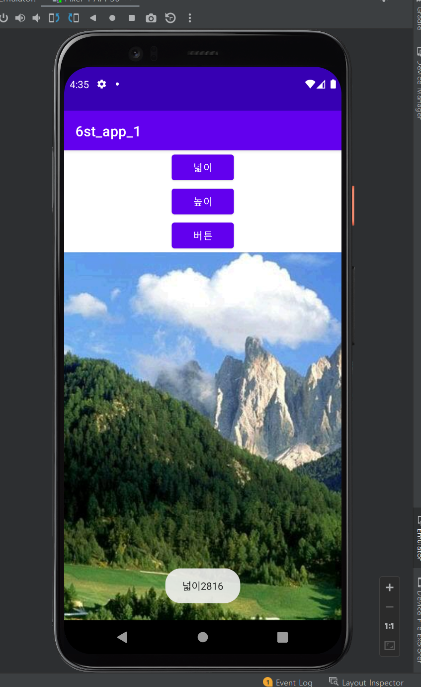
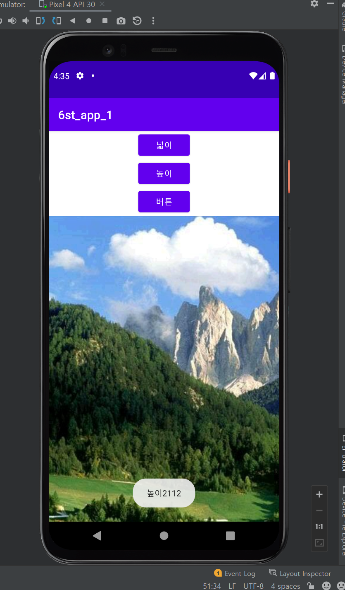
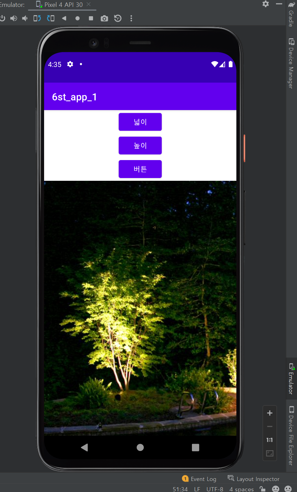
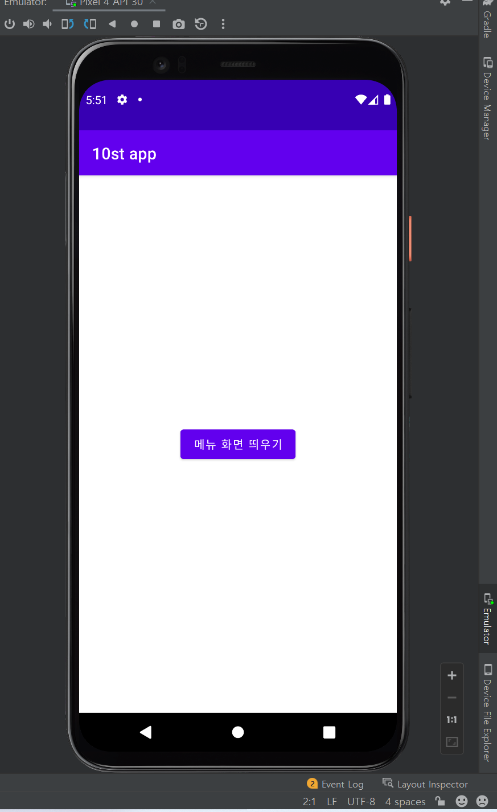
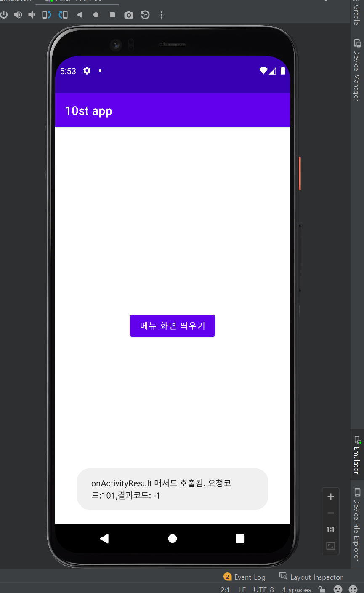
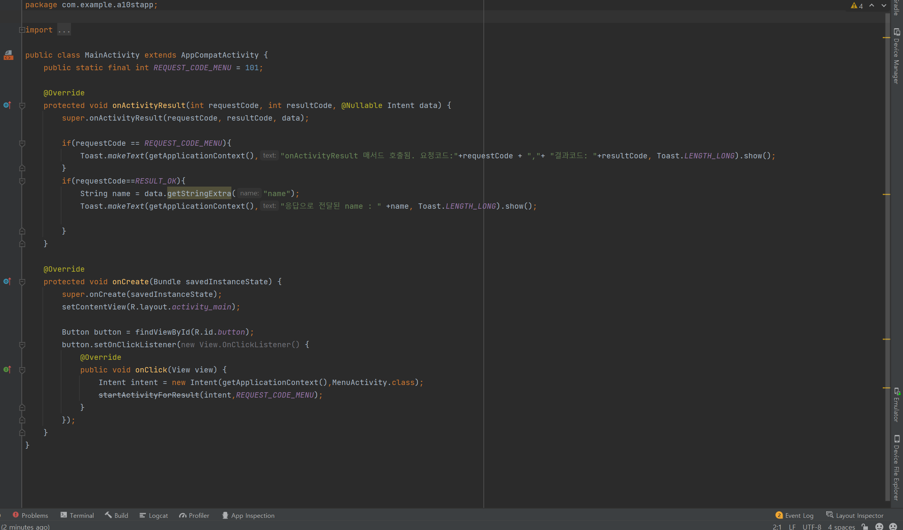
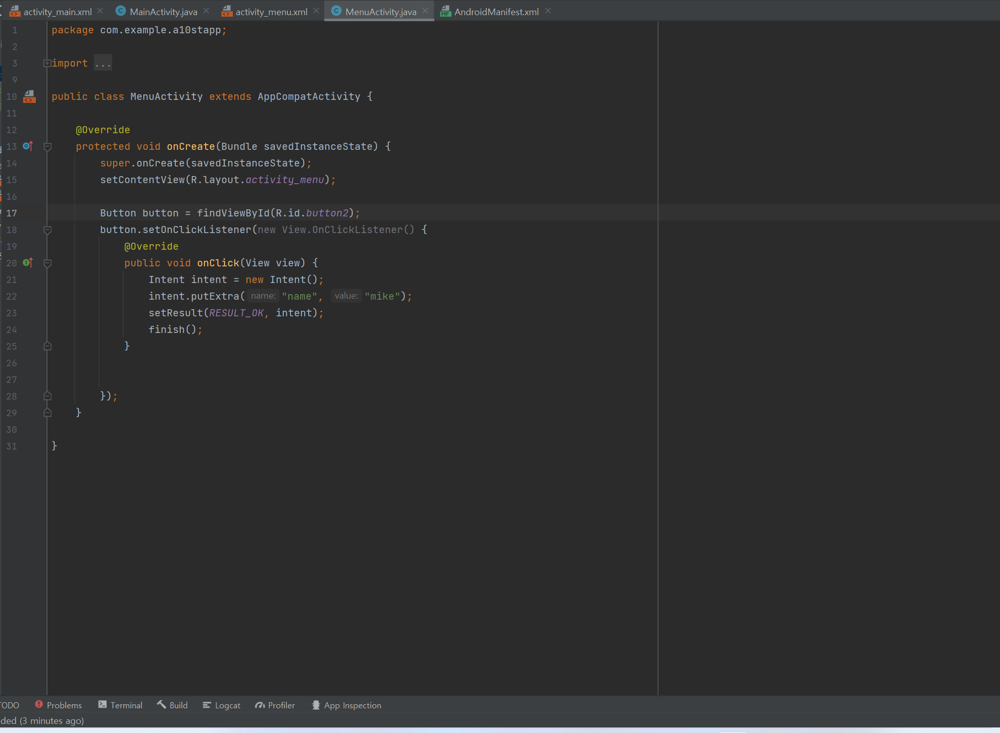

# 2주차(2202-03-15)
- 안드로이드스튜디오 설치 && 깃허브 가입 및 레포지토리 만듬
</img>

## 3주차 과제
</img>
</img>
</img>

## 5주차 과제(2022-04-05)
</img>
</img>
</img>
</img>

## 6주차 과제(2202-04-12)
</img>
</img>
</img>

## 10주차 과제(2202-05-10)
</img>
</img>
</img>
</img>
</img>

## 11주차 과제(2202-05-17)
</img>
